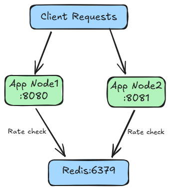

# sei-ratelimiter

Distributed Rate Limiter as a Service — Zartex SEI Project 1

---

## Architecture

---

## Algorithms

- Fixed Window
- Sliding Window
- Token Bucket

---

## API Reference

### POST /check

Checks whether request is allowed.

### POST /rules

Create a new rule.

### GET /rules

Get all rules.

### GET /rules/:id

Get rule by ID.

### DELETE /rules/:id

Delete rule.

---

## How To Run

Coming soon.

---

## How To Run Tests

Coming soon.

---

## Benchmarks

Coming soon.

---

## Failure Modes

Coming soon.

---

## What We Would Do at 10x Scale

Coming soon.