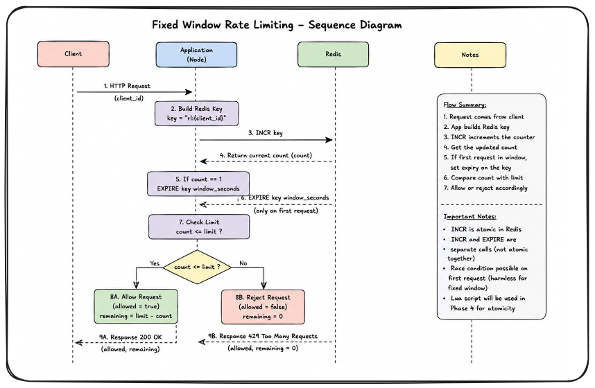

# sei-ratelimiter

Distributed Rate Limiter as a Service — Zartex SEI Project 1

---

## Architecture



---

## Algorithms

- Fixed Window
- Sliding Window
- Token Bucket

---

## API Reference

### POST /check

Checks whether request is allowed.

### POST /rules

Create a new rule.

### GET /rules

Get all rules.

### GET /rules/:id

Get rule by ID.

### DELETE /rules/:id

Delete rule.

---

## How To Run

Coming soon.

---

## How To Run Tests

Coming soon.

---

## Benchmarks

Coming soon.

---

## Failure Modes

Coming soon.

---

## What We Would Do at 10x Scale

Coming soon.


## How To Run

### Prerequisites

- Docker Desktop
- WSL2 enabled
- Git

### Start the full stack

```bash
git clone git@github.com:Zartex-the-art/sei-ratelimiter.git
cd sei-ratelimiter
docker compose up --build
```

This starts:

- App Node 1 → http://localhost:8080
- App Node 2 → http://localhost:8081
- Redis → localhost:6379

### Verify

```bash
curl http://localhost:8080/health
curl http://localhost:8081/health
```

Both should return:

```json
{"status":"ok"}
```

### Stop

```bash
docker compose down
```

## Project Structure

```text
sei-ratelimiter/
├── cmd/
│   └── server/                  # Entry point — wires packages, starts server
│       └── main.go
│
├── internal/
│   ├── algorithms/              # Rate limiting logic
│   │   ├── limiter.go           # Limiter interface
│   │   ├── fixed_window.go      # Fixed Window algorithm
│   │   ├── fixed_window_test.go # Fixed Window tests
│   │   ├── sliding_window.go    # Sliding Window (Phase 2)
│   │   └── token_bucket.go      # Token Bucket (Phase 2)
│   │
│   ├── api/                     # HTTP handlers
│   ├── config/                  # Environment variable loading
│   ├── store/                   # Redis client/store layer
│   └── testhelpers/             # Shared test utilities
│
├── tests/
│   └── load/                    # k6 load test scripts
│
├── docs/
│   ├── decisions/               # Architecture Decision Records
│   │   ├── 0000-template.md
│   │   ├── 0001-go-language-choice.md
│   │   ├── 0002-concurrency-model.md
│   │   ├── 0002-infrastructure-tooling.md
│   │   ├── 0003-package-structure.md
│   │   └── 0004-fixed-window-first.md
│   │
│   ├── diagrams/                # Architecture diagrams
│   │   ├── architecture-v1.png
│   │   ├── architecture-v2.png
│   │   ├── architecture-v3.png
│   │   ├── architecture-v4.png
│   │   └── fixed-window-sequence.png
│   │
│   ├── ARCHITECTURE.md
│   ├── CONCURRENCY.md
│   ├── DOCKER_CONCEPTS.md
│   ├── REDIS_KEY_DESIGN.md
│   ├── SHARED_STATE.md
│   ├── TEST_CONVENTIONS.md
│   └── TEST_STRATEGY.md
│
├── .github/
│   └── workflows/               # GitHub Actions CI
│
├── pkg/
├── practice/
│   ├── goroutine.go
│   ├── mutex.go
│   └── race.go
│
├── .env.example
├── .gitignore
├── docker-compose.yml
├── Dockerfile
├── go.mod
├── README.md
├── server_test.go
└── SPRINT_LOG.md
```


## Fixed Window Algorithm

The Fixed Window algorithm limits requests within a fixed time duration.

Example:
- Limit: 5 requests
- Window: 60 seconds

Flow:
1. Client sends request
2. Redis counter increments using INCR
3. Redis EXPIRE sets TTL on first request
4. If count <= limit:
   request allowed
5. Else:
   request blocked

Redis Commands:
- INCR
- EXPIRE

Advantages:
- Simple
- Fast
- Low memory usage

Tradeoff:
Fixed Window suffers from the Boundary Burst problem.
A client can send requests at the end of one window and beginning of another window, effectively doubling request rate.

Best Use Cases:
- Simple APIs
- Low complexity systems
- Basic rate limiting


## Algorithm Comparison

| Property | Fixed Window | Sliding Window | Token Bucket |
|----------|---------------|----------------|---------------|
| Redis data type | String | Sorted Set | Hash |
| Memory per client | O(1) | O(requests in window) | O(1) |
| Boundary burst | Yes (bug) | No | No |
| Burst allowance | No | No | Yes |
| Complexity | Low | Medium | Medium |
| Best for | Simple APIs | Precision-critical | Bursty clients |
| Implemented | Day 6-7 | Day 8 | Day 9 |
